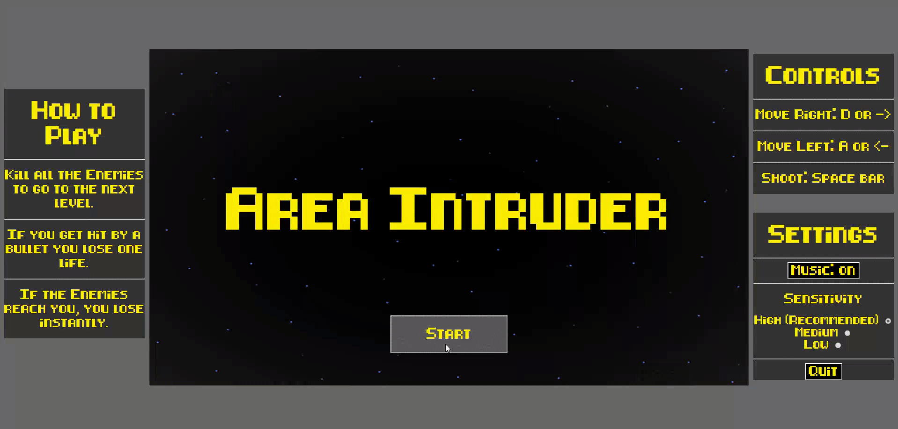

# Area-Intruder
This was a project that I created for my first year Programming and Scripting module at University.

Area Intruder is a game reminisant of Space Invaders. This game has an infinite level system, the enemies will increase in speed as levels are completed. Libraries have been used to add sound and menus.

# How to Install 

1. Download the Area_Intruder Folder.
2. Run the HTML file named Area_Intruder.
